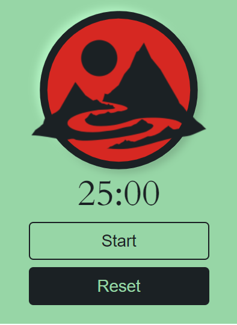
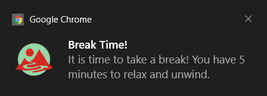

# Flow - Deep Work Tracker

Flow - Deep Work Tracker is a simple and straightforward pomodoro Timer. Flow aims to provide a visually appealing and reliable way to stay focused.

Flow is in its early stages, so feedback is welcome and appreciated!

## Demo


## Lessons Learned

This project was very interesting thanks to the Chrome Extension API.
Uniquely, almost every call to the API is done asynceronously.
Initially, I struggled because I am used to synchronous programming and using asyncronous programming at my leisure.
Using this API, I would adapted to this more asynchronous-mode of thinking.

This project was unique for me due to the lack of online resources to go to.
There does not seem to be a strong chrome extensions community online, so you are forced to explore and deal with your problems on your own.

## Optimizations

What optimizations did you make in your code? E.g. refactors, performance improvements, accessibility

## Screenshots




## Run Locally

1. Clone the project

```bash
  git clone https://link-to-project
```

2. Go to chrome://extensions on your chrome browser

3. Click on Load Unpacked and select the location of this repository. This should add the extension to your chrome
